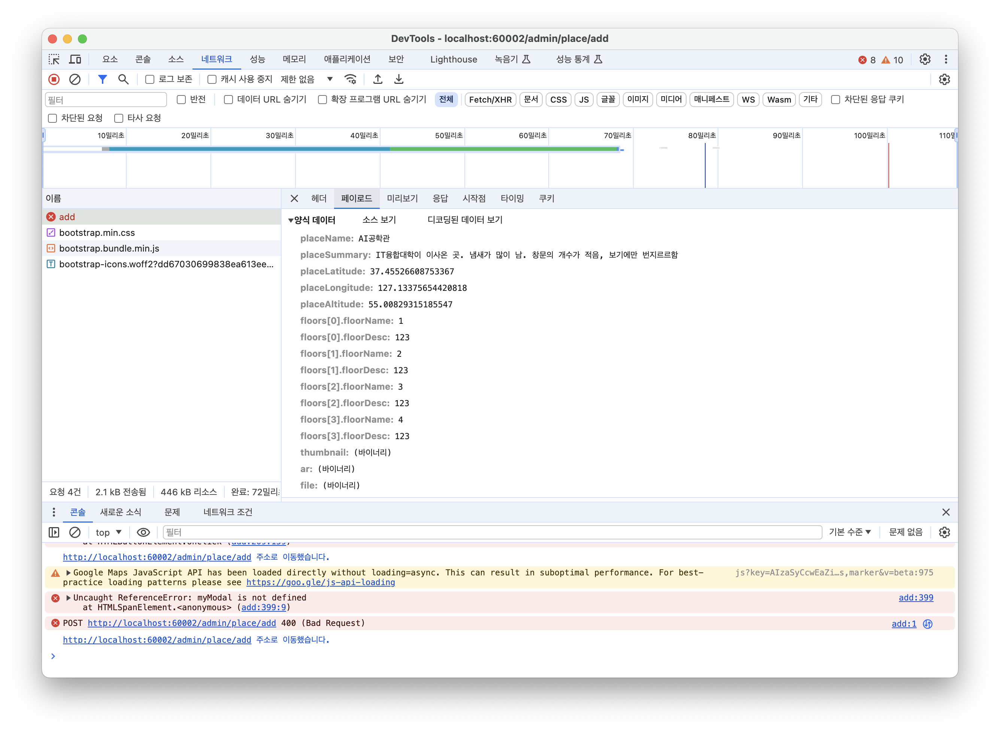

05/14
===

1. /event/add가 안들어가짐 코드를 추가함
> Invalid property 'eventDTO' of bean class [com.f2z.gach.Event.DTO.AdminEventRequestDTO]: Bean property 'eventDTO' is not readable or has an invalid getter method: Does the return type of the getter match the parameter type of the setter?
> > public AdminEventRequestDTO(Event event) {
this.event = event;
this.locations = new ArrayList<>();
}

05/13
===

1. GetMapping으로 똑같은 URL이 묶여 있어서 오류 뜸 :: URL 수정함
> org.springframework.beans.factory.BeanCreationException: Error creating bean with name 'requestMappingHandlerMapping' defined in class path resource [org/springframework/boot/autoconfigure/web/servlet/WebMvcAutoConfiguration$EnableWebMvcConfiguration.class]: Ambiguous mapping. Cannot map 'adminTestController' method
com.f2z.gach.Map.Controller.AdminTestController#getTestRoute(Integer, Integer, Model)
to {GET [/admin/map/test]}: There is already 'adminTestController' bean method
com.f2z.gach.Map.Controller.AdminTestController#testPage(Model) mapped.
> 
2. pagination에서 reverse가 안먹고 있음. 나머지 기능은 잘 작동함(지점 관리, 경로 관리)

05/11 진행 상황
===

1. 건물 관리 추가 뷰 완성

2. 추가 기능이 되어야 수정이 가능함.

05/11 남은 작업
===

1. 건물 관리 뷰 전체적으로 수정
2. 차트 관리
3. 안되어 있는 것들 보면서 추가해줘 민서

04/18 수정사항
===

1. com.f2z.gach.Map 내부 디렉터리 내의 같은 클래스 이름 중 @Entity로 선언된 것들 중에서 Entities빼고는 @Entity 어노테이션 삭제
2. >2024-04-18T23:56:28.433+09:00  WARN 69680 --- [  restartedMain] ConfigServletWebServerApplicationContext : Exception encountered during context initialization - cancelling refresh attempt: org.springframework.beans.factory.UnsatisfiedDependencyException: Error creating bean with name 'mapController' defined in file [/Users/nomyeongjun/Documents/2024-1/Project/GachProject/build/classes/java/main/com/f2z/gach/Map/MapController.class]: Unsatisfied dependency expressed through constructor parameter 0: No qualifying bean of type 'com.f2z.gach.Map.Service.MapService' available: expected at least 1 bean which qualifies as autowire candidate. Dependency annotations: {}
   > > 이런 오류가 발생해서
   > >  "MapController.java 내에서 private final MapService mapService; 이 부분 주석처리함.
   > 
3. Thymeleaf에서 스태틱 클래스를 전달했는데, 오류가 계속 발생해서 예전처럼 만들었음.
4. 그리고 @Column(unique = true) 중복되면 안되는 컬럼에 저 어노테이션을 추가하는거 어떰?
5.     Admin admin = adminRepository.findByAdminName(loginDto.getAdminId());
5. 5번 블록에서 admin을 findByAdminName으로 찾고 있는데 adminName으로 찾는건지 아니면, adminId로 찾는건지, Num은 숫자 카운트 고유 ID이고, adminId이 관리자가 입력하는 아이디가 아닌가 싶어서
6. Error 404 페이지는 만들어 놓아서 처리 잘못된 URL로 접근하면 처리 가능